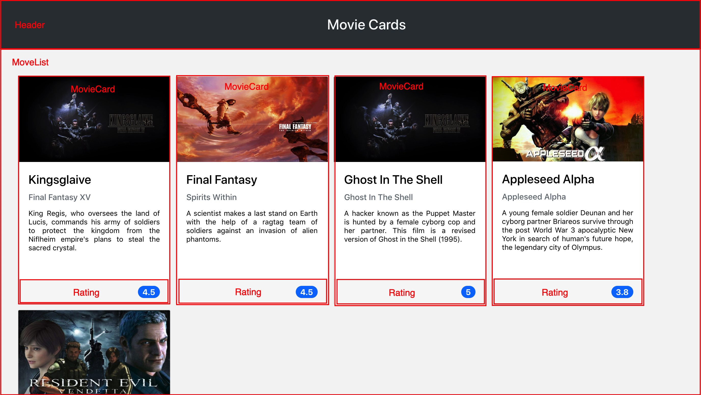

# Boas vindas ao projeto Movie Cards Library!

Esse projeto foi desenvolvido como exercício de aprovação do módulo introdutório ao React no curso da Trybe.  
Esse repositório foi criado no intuito de ir recebendo novas alterações, colocando em prática as habilidades aprendidas durante o curso.

## O que deverá ser desenvolvido

Foi solicitado desenvolver uma biblioteca de cartões de filmes utilizando React. A biblioteca deverá possuir um cabeçalho e uma lista de cartões. Cada cartão representa um filme e possui uma imagem, título, subtítulo, sinopse e avaliação. A biblioteca deverá ser algo parecido com a imagem abaixo.

Foi necessário implementar um conjunto de componentes em React para compor o App.

## Desenvolvimento e testes

O exercício continha um _template_ com um App React criado e configurado. Após clonar o projeto e instalar as dependências foi necessário completar este _template_ implementando os requisitos listados na próxima seção.

Criar quatro `React Components`:

   - Header
   - MovieList
   - MovieCard
   - Rating

Cada componente representa uma parte específica do site, conforme ilustrado abaixo:

Havia também um arquivo de testes, que foi utilizado para verificar a implementação de cada uma das especificações do projeto original.
